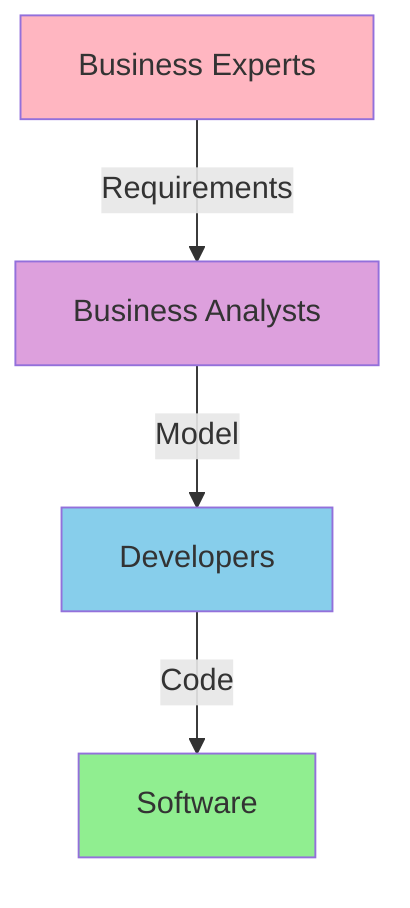
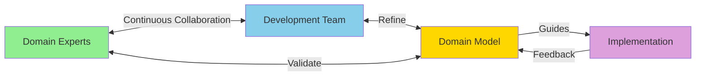
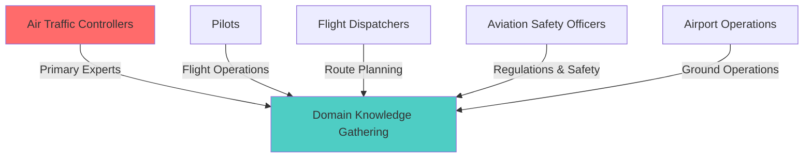
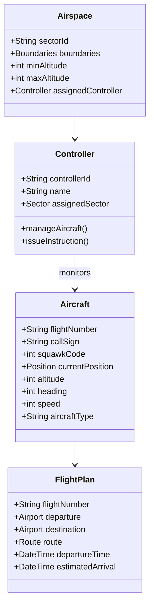
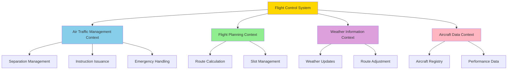
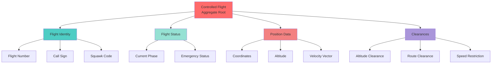
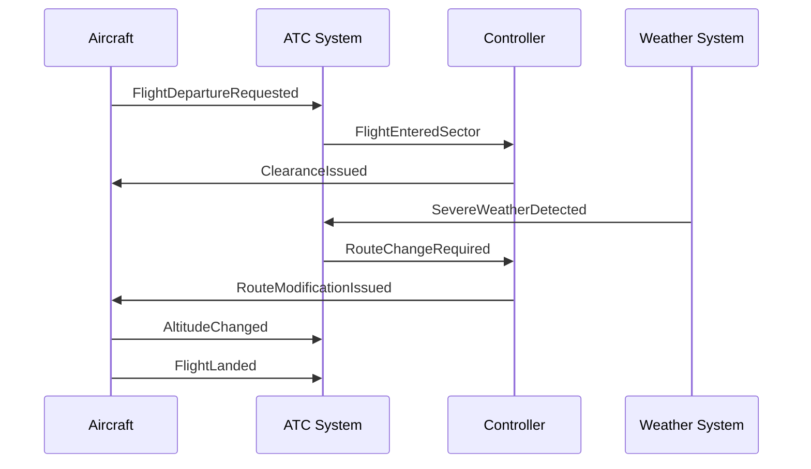
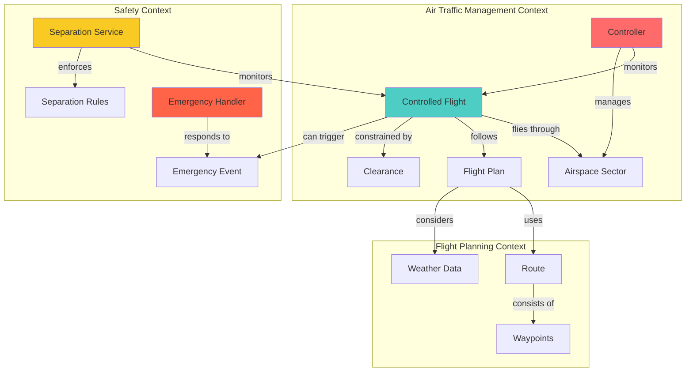
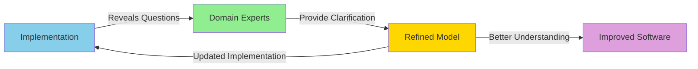
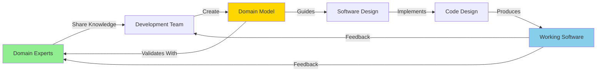

# 🏗️ Domain-Driven Design: A Comprehensive Guide

## Building Software That Reflects Reality

---

## 📖 Table of Contents

- [Introduction](#introduction)
- [Understanding the Domain](#understanding-the-domain)
- [Domain Experts: The Key to Success](#domain-experts-the-key-to-success)
- [The Abstraction: Domain Model](#the-abstraction-domain-model)
- [Software Design vs Code Design](#software-design-vs-code-design)
- [Building Domain Knowledge: Flight Control System Example](#building-domain-knowledge-flight-control-system-example)
- [Key Takeaways](#key-takeaways)

---

## 🎯 Introduction

**Domain-Driven Design (DDD)** is a software development approach that emphasizes collaboration between technical and domain experts to create software that truly reflects the business domain.

> 💡 **Core Principle:** The heart of software is its ability to solve domain-related problems for its users. All technical sophistication in the world is worthless if it doesn't serve this purpose.

DDD is not just about code—it's about understanding the problem space deeply before crafting the solution.

---

## 🌍 Understanding the Domain

### What is a Domain?

A **domain** is the sphere of knowledge and activity around which your application operates. It's a specific area of this world—like banking, healthcare, e-commerce, or air traffic control.

**Key Point:** A domain cannot just be taken and poured directly into code. We need to create an **abstraction** of the domain first.


### Why Abstraction Matters

Raw knowledge from domain experts isn't easily transformed into software constructs. We must:

1. **Learn** from domain experts
2. **Build** a mental blueprint (abstraction)
3. **Create** a domain model
4. **Implement** the software based on that model

---

## 👥 Domain Experts: The Key to Success

### Real-World Example: Banking Software

**Question:** Is it possible to create complex banking software without good domain knowledge?

**Answer:** No way. Never.

Let's see who knows banking best:

| Role | Banking Knowledge Level | Why? |
|------|------------------------|------|
| **Software Architect** | ❌ Low | Just uses banks to keep money safe |
| **Software Analyst** | ⚠️ Limited | Can analyze when given ingredients, but lacks deep domain knowledge |
| **Developer** | ❌ Very Low | Knows coding, not banking operations |
| **Bankers** | ✅ Expert | Know all details, catches, issues, rules, and exceptions |


### The Starting Point

> 🎯 **Always start with the domain experts.** They understand:
> - All the details
> - All the catches
> - All possible issues
> - All the rules and regulations
> - Edge cases and exceptions

---

## 🧠 The Abstraction: Domain Model

### What is a Domain Model?

According to Eric Evans (author of the DDD book):

> A domain model is **not** just a particular diagram. It is the **idea** that the diagram is intended to convey.

A domain model is:
- ✅ A rigorously organized and selective abstraction of domain knowledge
- ✅ Our internal representation of the target domain
- ✅ Can be represented as diagrams, code, or written language
- ❌ NOT just knowledge in a domain expert's head
- ❌ NOT just a UML diagram


### Why Do We Need a Model?

The world around us is overwhelming. Even a specific domain can be too much for a human mind to handle at once.

**We need to:**
1. Organize information
2. Systematize it
3. Divide it into smaller pieces
4. Group pieces into logical modules
5. Deal with one piece at a time


---

## 🎨 Software Design vs Code Design

### Understanding the Difference

| Aspect | Software Design | Code Design |
|--------|----------------|-------------|
| **Metaphor** | Architecture of a house | Location of painting on a wall |
| **Scope** | Big picture, structure | Details, implementation |
| **Impact** | Fundamental | Important but localized |
| **Cost of Error** | Very high, expensive to fix | Lower, easier to correct |
| **Focus** | System components, relationships | Algorithms, data structures |


### The Waterfall Problem

**Traditional Waterfall Approach:**



**Problems with Waterfall:**

- ❌ One-way flow of knowledge
- ❌ No feedback from analysts to business experts
- ❌ No feedback from developers to analysts
- ❌ Knowledge loss at each stage
- ❌ Misunderstandings compound over time

**Better Approach (DDD):**



---

## ✈️ Building Domain Knowledge: Flight Control System Example

Let's walk through building domain knowledge for an **Airplane Flight Control System**, from air traffic controller expertise to domain design blocks.

### Step 1: Identify Domain Experts



**Key Domain Experts:**
- Air Traffic Controllers (Primary)
- Pilots
- Flight Dispatchers
- Aviation Safety Officers
- Airport Operations Staff

### Step 2: Knowledge Discovery Sessions

**Questions to Ask Domain Experts:**

**Air Traffic Controller:**
- How do you manage multiple aircraft in your sector?
- What information do you need to track for each aircraft?
- How do you handle emergency situations?
- What are the separation requirements between aircraft?
- How do you communicate with pilots?

**Sample Insights:**
- "We maintain 1000 feet vertical separation below 29,000 feet"
- "Each aircraft has a unique transponder code (squawk code)"
- "We prioritize emergency aircraft (squawk 7700)"
- "Weather conditions affect routing decisions"

### Step 3: Identify Core Domain Concepts

From conversations, we extract key concepts:



### Step 4: Define Ubiquitous Language

Create a shared vocabulary between domain experts and developers:

| Domain Term | Definition | Usage Example |
|------------|------------|---------------|
| **Squawk Code** | 4-digit transponder identification code | "Aircraft squawk 1234 for identification" |
| **Cleared for Approach** | Permission granted to begin landing procedure | "You are cleared for ILS approach runway 27" |
| **Holding Pattern** | Racetrack-shaped flight path while waiting | "Enter holding pattern at ALPHA waypoint" |
| **Flight Level** | Altitude in hundreds of feet (above 18,000 ft) | "Climb and maintain flight level 350" (35,000 ft) |
| **Separation Minima** | Minimum safe distance between aircraft | "Maintain 5 nautical miles separation" |
| **Handoff** | Transfer of control from one controller to another | "Contact approach on 119.5" |

### Step 5: Identify Bounded Contexts

Different parts of the system have different concerns:



### Step 6: Model Key Aggregates and Entities

**Aggregate: Controlled Flight**



### Step 7: Define Domain Events

Events that matter in the domain:



**Key Domain Events:**
- `FlightDepartureRequested`
- `FlightEnteredSector`
- `ClearanceIssued`
- `EmergencyDeclared`
- `SeparationViolationDetected`
- `HandoffInitiated`
- `WeatherHazardDetected`
- `AltitudeChanged`
- `FlightLanded`

### Step 8: Build the Domain Model

Final integrated domain model:



### Step 9: Implement Core Domain Logic

**Example: Separation Violation Detection**

```
Domain Rule (from ATC Expert):
"Aircraft must maintain minimum 5 nautical miles horizontal 
separation OR 1000 feet vertical separation below FL290"

Implementation in Code:
- Calculate horizontal distance between aircraft
- Check vertical separation
- Apply minimum separation rules based on flight level
- Trigger SeparationViolationDetected event if violated
```

### Step 10: Continuous Refinement



**Continuous Feedback Loop:**
1. Implement based on current understanding
2. Discover edge cases and questions
3. Consult domain experts
4. Refine the model
5. Update implementation
6. Repeat

---

## 🎯 Key Takeaways

### ✅ Do's

1. **Always start with domain experts** - They hold the real knowledge
2. **Build a shared language** - Create ubiquitous language everyone understands
3. **Create abstractions** - Don't try to model everything, be selective
4. **Iterate continuously** - Domain understanding deepens over time
5. **Focus on software design first** - Get the big picture right before details
6. **Enable feedback loops** - Avoid one-way knowledge flow

### ❌ Don'ts

1. **Don't skip domain experts** - Developers and architects aren't domain experts
2. **Don't try to code the domain directly** - Abstraction is necessary
3. **Don't use waterfall processes** - Feedback is essential
4. **Don't confuse diagrams with models** - The model is the idea, not the picture
5. **Don't treat code design and software design the same** - They operate at different levels

### 📊 Success Formula



---

## 📚 Further Reading

- **Book:** "Domain-Driven Design: Tackling Complexity in the Heart of Software" by Eric Evans
- **Focus Areas:**
    - Ubiquitous Language
    - Bounded Contexts
    - Aggregates and Entities
    - Domain Events
    - Strategic Design
    - Tactical Design Patterns

---

## 🤝 Contributing

Understanding domain-driven design is a journey. Each domain teaches us new lessons. Share your experiences and insights to help others learn!

---

**Remember:** Great software starts with great domain understanding. Invest time in learning the domain, and the code will follow naturally.